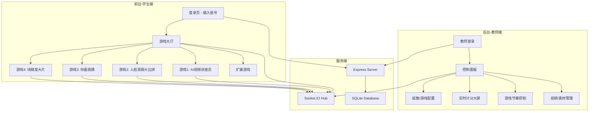

# AI 挑战赛比赛网站 — 实现计划

## 项目概述

构建一个用于学生 AI 挑战赛的全栈比赛网站。包含前台（学生端）和后台（教师端），支持4个核心游戏 + 扩展游戏，实时计分，组号登录与设备互斥。

---

## 技术栈

| 层次 | 技术 | 理由 |
|:---|:---|:---|
| **后端框架** | Node.js + Express | 轻量、生态成熟 |
| **实时通信** | Socket.IO | 双向实时通信，控制节奏、同步分数 |
| **数据存储** | SQLite (better-sqlite3) | 零配置、单文件数据库，适合比赛场景 |
| **前端** | 原生 HTML/CSS/JS | 简单直接，无需构建工具 |
| **AI图片生成** | Gemini API (通过 kegeai 中转) | 用户指定的线稿变大片功能 |
| **AI画画识别** | 内嵌 Quick Draw 或 Gemini 识别 | 你画我猜功能 |

---

## 系统架构



---

## 项目目录结构

```
AI赛游戏/
├── server/
│   ├── index.js              # 主服务入口
│   ├── db.js                 # 数据库初始化与操作
│   ├── routes/
│   │   ├── admin.js           # 后台API路由
│   │   ├── auth.js            # 登录/登出/设备互斥
│   │   ├── game1.js           # AI视频侦查员 API
│   │   ├── game2.js           # 人脸真假大比拼 API
│   │   ├── game3.js           # 你画我猜 API
│   │   └── game4.js           # 线稿变大片 API
│   ├── socket/
│   │   └── handler.js         # Socket.IO 事件处理
│   └── data/
│       ├── videos/            # 游戏1的视频文件
│       ├── faces/             # 游戏2的人脸图片
│       │   ├── real/          # 真实人脸
│       │   └── fake/          # AI人脸
│       └── uploads/           # 学生上传的画作
├── public/
│   ├── index.html             # 学生端入口/登录页
│   ├── lobby.html             # 游戏大厅
│   ├── game1.html             # AI视频侦查员
│   ├── game2.html             # 人脸真假大比拼
│   ├── game3.html             # 你画我猜
│   ├── game4.html             # 线稿变大片
│   ├── extensions.html        # 扩展游戏
│   ├── admin/
│   │   ├── index.html         # 教师后台登录
│   │   ├── dashboard.html     # 主控制面板
│   │   ├── scoreboard.html    # 大屏计分板
│   │   ├── game1-control.html # 游戏1控制
│   │   ├── game2-control.html # 游戏2控制
│   │   ├── game3-control.html # 游戏3控制
│   │   └── game4-control.html # 游戏4控制
│   ├── css/
│   │   ├── main.css           # 全局样式/设计系统
│   │   ├── admin.css          # 后台样式
│   │   └── games.css          # 游戏页面样式
│   ├── js/
│   │   ├── socket-client.js   # Socket.IO 客户端封装
│   │   ├── auth.js            # 登录逻辑
│   │   ├── game1.js           # 游戏1前端逻辑
│   │   ├── game2.js           # 游戏2前端逻辑
│   │   ├── game3.js           # 游戏3前端逻辑
│   │   ├── game4.js           # 游戏4前端逻辑
│   │   └── admin.js           # 后台管理逻辑
│   └── extensions/            # 解压的4个谷歌小游戏
│       ├── hole-in-one/
│       ├── nonogram/
│       ├── stretchy-cat/
│       └── supersonic-bot/
├── package.json
└── .env                       # API密钥等配置
```

---

## 核心功能详细设计

### 1. 登录与设备互斥系统

- 学生选择组号（1~N，N由后台配置，默认5-20）
- 每个组号同时只允许1台设备在线
- **实现方式**：
  - 登录时生成 `sessionToken`，存入数据库和浏览器 `localStorage`
  - Socket.IO 连接时携带 `sessionToken` 验证
  - 新设备登录同一组号时：
    - 向已在线设备发送 Socket 通知："有其他设备尝试登录，是否下线？"
    - 已在线设备有10秒选择时间：保持在线 / 主动下线
    - 如果已在线设备不响应或选择下线，新设备自动替代
  - 后台实时显示每组在线状态（绿色在线/灰色离线）

### 2. 游戏1：AI视频侦查员

**后台功能：**
- 上传/管理约10个视频（支持mp4格式）
- 每个视频标记答案（AI生成 / 真实视频）
- 控制当前播放的视频题号（逐题推进）
- 公布答案按钮 → 前台显示正确答案
- 播放视频不限次数
- 实时查看所有组的提交状态和得分

**前台功能：**
- 显示当前视频题目（由老师控制推进）
- 每个视频最多播放2次，播完不再显示画面（显示"播放次数已用完"）
- 视频第一次播放结束后，显示判断按钮："AI生成" / "真实视频"
- 1分钟倒计时提交窗口
- 每题只能提交一次，提交后按钮禁用
- 提交后显示"等待老师公布答案..."
- 答案公布后显示对错，更新本组得分
- 每题5分

**数据结构：**
```sql
-- 视频题目表
CREATE TABLE game1_videos (
    id INTEGER PRIMARY KEY,
    filename TEXT,
    title TEXT,
    answer TEXT, -- 'ai' or 'real'
    sort_order INTEGER
);

-- 提交记录
CREATE TABLE game1_submissions (
    group_id INTEGER,
    video_id INTEGER,
    answer TEXT,
    play_count INTEGER DEFAULT 0,
    is_correct BOOLEAN,
    score INTEGER DEFAULT 0,
    PRIMARY KEY(group_id, video_id)
);
```

### 3. 游戏2：人脸真假大比拼

**素材准备：**
- 准备10组图片，每组包含1张真人脸 + 1张AI人脸
- 图片来源：使用 generate_image 工具生成AI人脸，配合网上公开的真实人脸
- 后台存储答案（左边是真 / 右边是真）

**后台功能：**
- 管理10组人脸图片（每组2张）
- 标记每组的答案
- 控制当前题号
- 公布答案

**前台功能：**
- 显示两张人脸，学生点击选择"哪个是真人"
- 1分钟倒计时
- 每题只能提交一次
- 每题5分
- 其他流程与游戏1相同（老师控制节奏）

### 4. 游戏3：你画我猜

**实现方案：使用 Gemini API 进行画作识别（不内嵌 Quick Draw）**

> [!IMPORTANT]
> Quick Draw 无法简单内嵌（跨域限制），建议自建画板 + 使用 Gemini API 识别画作。这样可以完全控制游戏逻辑和计分。

**后台功能：**
- 设置10个绘画主题（如：猫、飞机、房子、太阳等）
- 设置总时长（默认10分钟）
- 开始/结束游戏控制
- 实时查看每组得分

**前台功能：**
- Canvas 画板（支持画笔粗细、颜色、橡皮擦、清空）
- 显示当前主题词（如"请画一只猫"）
- 20秒倒计时（每个主题）
- 学生画完后提交 → 服务端调用 Gemini API 判断画作是否符合主题
- 如果 AI 识别正确 → +5分
- 自动切换下一个主题
- 10个主题画完或10分钟用完结束

**Gemini 识别调用：**
```javascript
// 将canvas转为base64 → 发送给Gemini API判断
const prompt = `这是一幅简笔画，请判断它画的是否是"${theme}"。只回答"是"或"否"。`;
```

### 5. 游戏4：线稿变大片

> [!IMPORTANT]
> 用户指定 API：`https://api.kegeai.top/`，模型 `gemini-2.0-flash-preview-image-generation`。
> 由于该中转站使用 OpenAI 兼容协议，图片生成需要通过 chat completions 接口，在 prompt 中描述线稿并请求生成图片。实际调用方式需要测试确认。

**后台功能：**
- 查看每组的线稿和生成结果
- AI评分自动进行（5-10分）
- 实时计分

**前台功能：**
- Canvas 画板（手绘线稿）
- "AI 生成大片"按钮 → 将线稿发送到 Gemini API
- 生成结果展示
- AI 自动评分（创意度5-10分）
- 每组3次机会
- 显示剩余机会数和最高得分

**API 调用流程：**
```
1. 学生在Canvas画线稿
2. Canvas → Base64 图片
3. 发送到后端 → 后端调用 Gemini API
4. Prompt: "请根据这幅手绘线稿，生成一张精美的写实风格照片/图片。"
5. 返回生成的图片展示给学生
6. 再次调用 Gemini API 评分
7. Prompt: "请给这幅手绘线稿的创意程度打分(5-10分)，只返回数字。"
```

### 6. 扩展游戏

- 解压4个zip包到 `public/extensions/`
- 后台开关控制是否在前台显示
- 不参与计分
- 以 iframe 方式嵌入展示

### 7. 后台计分大屏

- 独立页面，可投屏使用
- **大字体显示**所有组的实时总分
- 按总分排名
- 每个游戏的分项得分
- 实时刷新（Socket.IO 推送）
- 视觉效果：排名变动动画、霓虹风格

---

## 设计风格

- **深色科技风**：暗色背景 + 霓虹发光效果（蓝/紫/绿渐变）
- **字体**：Google Fonts - Inter / Orbitron（科技感）
- **卡片式布局**：毛玻璃效果 (glassmorphism)
- **动效**：按钮悬停发光、分数变化弹跳、排名切换滑动
- **后台大屏**：霓虹风格排行榜，字体足够大（投影仪友好）

---

## 已确认事项

- API模型名：使用 `gemini-2.5-flash-image-preview`（备选：gemini-3.1-flash-image-preview）
- 人脸素材：AI生成假脸 + 公开真人脸，优先选用亚洲人脸（活动在香港举行）
- 你画我猜：自建画板 + Gemini API 识别，支持实时猜测
- 后台密码：`xiangjin1215`
- 视频素材：先用占位方案，用户后续添加
- 线稿变大片参考图：左侧画板 + 右侧AI生成结果展示 + 下方撤销/清除按钮

---

## 验证计划

### 自动化测试
```bash
# 启动服务器并验证所有路由
npm start
# 测试API端点
curl http://localhost:3000/api/admin/groups
curl http://localhost:3000/api/auth/login -X POST -d '{"groupId": 1}'
```

### 浏览器测试
1. **登录测试**：验证组号登录、设备互斥
2. **游戏1测试**：视频播放计数、提交、计分
3. **游戏2测试**：图片加载、选择、计分
4. **游戏3测试**：Canvas画图、AI识别
5. **游戏4测试**：线稿绘制、API调用、图片生成
6. **后台测试**：控制面板、分数大屏显示
7. **实时同步测试**：多标签页模拟多组同时在线

### 手动验证
- 教师控制游戏节奏（推进题目、公布答案）
- 计分板投屏显示效果
- 移动端响应式布局
